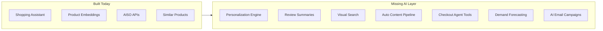
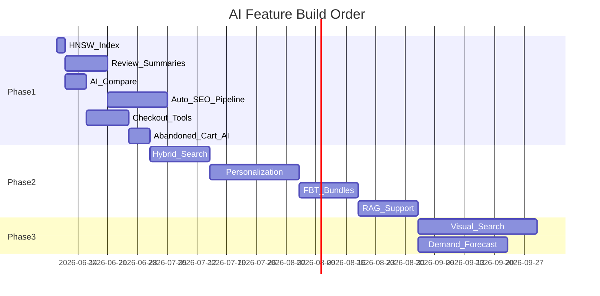
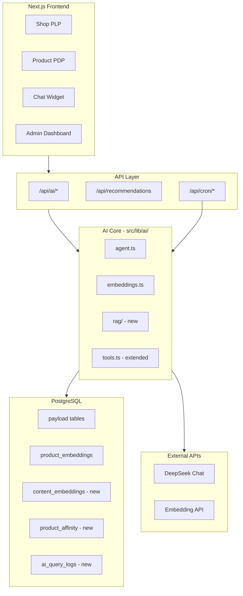

# AI-Native E-Commerce Feature Roadmap

## Current Platform Assessment

Your platform is a **mature single-store e-commerce site** (Bangladesh/BDT market) built on **Next.js 16 + Payload CMS 3.85 + PostgreSQL + pgvector**, with substantial commerce features already live.

### What Already Exists (Strong Foundation)

| Area | Status | Key Files |
|------|--------|-----------|
| AI Shopping Assistant | Live (DeepSeek tool-calling) | [`src/lib/ai/agent.ts`](src/lib/ai/agent.ts), [`src/lib/ai/tools.ts`](src/lib/ai/tools.ts) |
| Vector semantic search | Live (products only) | [`src/lib/ai/semanticSearch.ts`](src/lib/ai/semanticSearch.ts), [`src/lib/ai/embeddings.ts`](src/lib/ai/embeddings.ts) |
| Similar products | Live (embedding cosine) | [`src/lib/ai/similarProducts.ts`](src/lib/ai/similarProducts.ts) |
| AISO/GEO content APIs | Live | [`src/lib/seo/aiContent.ts`](src/lib/seo/aiContent.ts), `/api/ai/*`, `/llms.txt` |
| Chat widget + human handoff | Live | [`src/components/chat/ChatWidget.tsx`](src/components/chat/ChatWidget.tsx) |
| Product compare (static) | Live, no AI | [`src/app/(app)/compare/page.tsx`](src/app/(app)/compare/page.tsx) |
| Reviews + Q&A | Live, no AI summarization | [`src/collections/ProductReviews/`](src/collections/ProductReviews/) |
| Bundles, loyalty, referrals | Live (CMS-driven) | [`src/collections/ProductBundles/`](src/collections/ProductBundles/) |
| Abandoned cart cron | Live (template email) | `/api/cron/abandoned-carts` |
| Sales dashboard | Live (rule-based insights) | [`src/lib/admin/buildSalesInsights.ts`](src/lib/admin/buildSalesInsights.ts) |
| Analytics events | Live | [`src/collections/AnalyticsEvents/`](src/collections/AnalyticsEvents/) |

### Critical Gaps (AI Opportunity)



- **No HNSW index** on `product_embeddings` — scale risk at 10k+ SKUs
- **PLP search is text-only** (`like` on title/slug); semantic search only via AI API/chat
- **No personalization** beyond recently-viewed and CMS-curated blocks
- **SEO content is manual** — fields exist in [`productSeoContentFields.ts`](src/lib/seo/productSeoContentFields.ts) but no auto-generation on publish
- **No review/Q&A AI**, no comparison AI, no visual search, no demand forecasting
- **No AI observability** — no logging of search quality, assistant queries, or embedding drift

---

## Top 20 Highest-Impact AI Features

### Feature Matrix

| # | Feature | Business Value | Complexity | ROI | Model |
|---|---------|---------------|------------|-----|-------|
| 1 | Hybrid Semantic PLP Search | Conversion + discovery | Medium | **High** | Embedding API + DeepSeek rerank |
| 2 | AI Review Summarization | Trust + conversion on PDP | Low | **High** | DeepSeek |
| 3 | Auto SEO/AISO Content Pipeline | SEO/AEO/GEO visibility | Medium | **High** | DeepSeek |
| 4 | AI Product Comparison | Decision support, lower bounce | Low | **High** | DeepSeek |
| 5 | Checkout Assistant Tools | Cart abandonment reduction | Medium | **High** | DeepSeek + tools |
| 6 | Personalized Recommendations | AOV + engagement | Medium | **High** | Embeddings + co-occurrence |
| 7 | Frequently Bought Together | AOV uplift | Medium | **High** | Order co-occurrence + DeepSeek |
| 8 | AI Bundle/Outfit Builder | AOV + cross-sell | Medium | **High** | Embeddings + DeepSeek |
| 9 | Abandoned Cart AI Emails | Recovery revenue | Low | **High** | DeepSeek |
| 10 | AI Search Autocomplete Upgrade | Discovery UX | Low | **Medium** | Embeddings |
| 11 | RAG Customer Support | Support efficiency | Medium | **Medium** | DeepSeek + pgvector |
| 12 | Churn Prediction + Win-back | Retention | Medium | **Medium** | DeepSeek + rules |
| 13 | AI Email/Push Personalization | Marketing ROI | Medium | **Medium** | DeepSeek |
| 14 | Admin Demand Forecasting | Ops efficiency | High | **Medium** | DeepSeek + time-series |
| 15 | Low-Stock Prediction Alerts | Ops efficiency | Medium | **Medium** | Statistical + DeepSeek narrative |
| 16 | Visual Search | Unique discovery | High | **Medium** | CLIP/multimodal embedding |
| 17 | Conversational Checkout | Novel UX | High | **Medium** | DeepSeek agent |
| 18 | Dynamic Pricing Recommendations | Margin optimization | High | **Medium** | DeepSeek + analytics |
| 19 | Fraud Detection Scoring | Loss prevention | High | **Low-Medium** | Rules + DeepSeek |
| 20 | AI Blog/Content Engine | SEO + traffic | Medium | **Medium** | DeepSeek |

---

## Detailed Feature Specifications

### 1. Hybrid Semantic PLP Search
- **Business Value:** 15–30% improvement in search-to-PDP click-through (industry benchmark for semantic vs keyword)
- **User Benefits:** "gift for wife under 2000 BDT", "comfortable office shirt" work on `/shop?q=`
- **Data:** Existing `product_embeddings`, `analytics-events` (search queries)
- **Approach:** Extend [`src/lib/search/productSearch.ts`](src/lib/search/productSearch.ts) — vector candidates + Payload filters (price, category, stock) + DeepSeek rerank top 50 → 24
- **Build on:** [`src/app/(app)/api/ai/semantic-search/route.ts`](src/app/(app)/api/ai/semantic-search/route.ts)

### 2. AI Review Summarization
- **Business Value:** +5–12% PDP conversion when review summaries shown (Baymard-adjacent UX pattern)
- **User Benefits:** Pros/cons, sentiment score, common complaints at a glance
- **Data:** `product-reviews` (approved), product attributes
- **Approach:** Payload hook on review approval → batch summarize when count changes; cache in new `reviewSummary` group on products or separate `product_review_summaries` table
- **Model:** DeepSeek (`deepseek-chat`) — cheap, good at structured JSON output

### 3. Auto SEO/AISO Content Pipeline
- **Business Value:** 20–40% increase in long-tail organic + AI citation traffic over 6 months
- **User Benefits:** Richer PDP/category pages with FAQs, buying guides
- **Data:** Product title, description, variants, category, brand, reviews
- **Approach:** `afterChange` hook on product publish → DeepSeek generates `seoContent` fields (already defined in [`productSeoContentFields.ts`](src/lib/seo/productSeoContentFields.ts)); admin review queue for drafts
- **Extend:** Same pipeline for categories/brands/posts via existing [`generateTaxonomyGeo.ts`](src/lib/seo/geoContent/generateTaxonomyGeo.ts)

### 4. AI Product Comparison
- **Business Value:** Reduces comparison-page abandonment; supports high-consideration purchases
- **User Benefits:** "Which is better value?" answered in natural language on `/compare`
- **Data:** Compare page already loads up to 3 products with specs
- **Approach:** Add `CompareAiPanel` client component → `/api/ai/compare` with product JSON context → DeepSeek structured response (winner, tradeoffs, value score)
- **Build on:** [`src/components/compare/ComparePageClient.tsx`](src/components/compare/ComparePageClient.tsx)

### 5. Checkout Assistant Tools
- **Business Value:** 5–15% cart abandonment reduction
- **User Benefits:** Shipping ETA, promo eligibility, loyalty balance, return policy in chat during checkout
- **Data:** Cart, shipments, promo-codes, loyalty-transactions, user addresses
- **Approach:** Extend [`AI_SHOPPING_TOOLS`](src/lib/ai/tools.ts) with `getShippingQuote`, `applyPromoCode`, `getLoyaltyBalance`, `explainCheckoutStep`; inject cart context from [`ChatPanel`](src/components/chat/ChatPanel.tsx)

### 6. Personalized Recommendations Engine
- **Business Value:** +10–25% click-through on recommendation widgets; +5–10% AOV
- **User Benefits:** Homepage/PDP/cart widgets reflect taste and purchase history
- **Data:** `recently-viewed`, `orders`, `wishlists`, `analytics-events`, embeddings
- **Approach:** Score = 0.4×embedding similarity + 0.3×category affinity + 0.2×co-purchase + 0.1×popularity; new `/api/recommendations?context=homepage|pdp|cart`

### 7. Frequently Bought Together
- **Business Value:** Classic 10–20% AOV lift on bundle attach
- **User Benefits:** "Customers also bought" with one-click add
- **Data:** `orders` line items (historical co-occurrence matrix)
- **Approach:** Nightly cron builds `product_affinity` table; DeepSeek generates natural-language bundle titles; surface on PDP below add-to-cart

### 8. AI Bundle/Outfit Builder
- **Business Value:** Differentiated cross-sell; higher AOV on fashion/apparel
- **User Benefits:** Select shirt → AI suggests matching pants, shoes, accessories
- **Data:** Product embeddings, category taxonomy, variant attributes (color, gender)
- **Approach:** Vector similarity within complementary categories + DeepSeek outfit rationale; integrate with existing [`ProductBundleOffers`](src/components/product/ProductBundleOffers.tsx)

### 9. Abandoned Cart AI Emails
- **Business Value:** 10–15% recovery rate vs 3–5% generic (personalized copy)
- **User Benefits:** Relevant product reminders, applicable promo, shipping reassurance
- **Data:** Cart contents, user history, promo-codes
- **Approach:** Enhance [`/api/cron/abandoned-carts`](src/app/(app)/api/cron/abandoned-carts) — DeepSeek generates subject + body per cart segment; A/B test vs template

### 10. AI Search Autocomplete Upgrade
- **Business Value:** Faster discovery; reduces zero-result searches
- **User Benefits:** Semantic suggestions in header typeahead
- **Data:** Embeddings + popular queries from analytics
- **Approach:** Upgrade [`GlobalProductSearch.tsx`](src/components/Header/GlobalProductSearch.tsx) to call hybrid search API; show "AI matched" badge on fuzzy results

### 11. RAG Customer Support
- **Business Value:** 30–50% reduction in human agent load
- **User Benefits:** Instant answers on shipping, returns, order status
- **Data:** CMS pages (FAQ, policies), order data, product FAQs from `seoContent.faqs`
- **Approach:** Embed policy/FAQ chunks in `content_embeddings` table; extend assistant with `searchKnowledgeBase` tool; RAG context injection before DeepSeek reply

### 12. Churn Prediction + Win-back
- **Business Value:** 5–10% reactivation of lapsed customers
- **User Benefits:** Timely offers when they're likely to leave
- **Data:** Order recency/frequency, email engagement, wishlist activity
- **Approach:** Weekly cron scores users (RFM + simple rules); trigger win-back via existing notification-broadcasts + DeepSeek copy

### 13. AI Email/Push Personalization
- **Business Value:** 20–40% higher CTR on campaigns
- **User Benefits:** Relevant product picks, not generic blasts
- **Data:** Segments from analytics, wishlist, browse history
- **Approach:** Extend [`notification-broadcasts`](src/collections/NotificationBroadcasts/) with AI body generation; integrate Klaviyo/web-push with personalized product blocks

### 14. Admin Demand Forecasting
- **Business Value:** 10–20% reduction in stockouts/overstock
- **User Benefits:** Fewer "out of stock" disappointments
- **Data:** Order history by SKU, seasonality, promotions
- **Approach:** Time-series forecast (moving average + trend) per variant; DeepSeek generates narrative insights in sales dashboard; new admin widget in [`SalesDashboard`](src/components/admin/SalesDashboard/)

### 15. Low-Stock Prediction Alerts
- **Business Value:** Proactive replenishment before stockouts
- **Data:** Inventory levels, sales velocity (existing [`fetchLowStockItems.ts`](src/lib/inventory/fetchLowStockItems.ts))
- **Approach:** Days-of-stock-remaining calculation + DeepSeek reorder recommendations in admin notifications

### 16. Visual Search
- **Business Value:** Unique differentiator; 8–15% engagement lift on fashion
- **User Benefits:** Upload photo → find similar products
- **Data:** Product image URLs from `media` collection
- **Approach:** Image embeddings (OpenAI `text-embedding-3-large` with image input, or dedicated CLIP API) stored in `product_image_embeddings`; new `/api/ai/visual-search`

### 17. Conversational Checkout
- **Business Value:** Novel UX; potential 10%+ mobile conversion lift
- **Approach:** Agent tools: `addToCart`, `setAddress`, `selectShipping`, `initiatePayment` with confirmation gates; high security/complexity

### 18. Dynamic Pricing Recommendations
- **Business Value:** 2–5% margin improvement
- **Data:** Competitor prices (manual input), demand, inventory age
- **Approach:** Admin-only suggestions; never auto-price without approval

### 19. Fraud Detection Scoring
- **Business Value:** Reduces COD fraud (critical in Bangladesh market)
- **Data:** Order patterns, address history, velocity
- **Approach:** Rule-based score + DeepSeek anomaly narrative for admin review queue

### 20. AI Blog/Content Engine
- **Business Value:** Organic traffic + AEO citations
- **Data:** Product catalog, trending searches, seasonal events
- **Approach:** Admin "Generate buying guide" action on categories; DeepSeek drafts post → editor review → publish

---

## Estimated Revenue Impact (12-Month Projection)

Assumptions: mid-size catalog (500–5,000 SKUs), existing traffic, BDT market. Ranges are conservative industry benchmarks applied to your feature set.

| Initiative | Metric Impact | Est. Annual Revenue Lift |
|------------|--------------|---------------------------|
| Hybrid search + autocomplete | +8–15% search conversion | 3–8% total revenue |
| Review summarization + comparison AI | +5–10% PDP conversion | 2–5% total revenue |
| Personalized recs + FBT + bundles | +8–15% AOV | 4–10% total revenue |
| Checkout assistant + abandoned cart AI | -10% cart abandonment | 2–6% total revenue |
| Auto SEO/AISO pipeline | +25–50% organic/AI traffic | 5–15% total revenue (lagging) |
| Retention (churn, win-back, email AI) | +10% repeat purchase rate | 3–7% total revenue |
| **Combined (with overlap discount)** | | **15–35% revenue uplift potential** |

---

## Implementation Effort Estimates

| Feature | Effort | Team |
|---------|--------|------|
| Review summarization | 1–2 weeks | 1 dev |
| AI comparison panel | 1 week | 1 dev |
| Hybrid PLP search | 2–3 weeks | 1 dev |
| Auto SEO pipeline | 2–3 weeks | 1 dev |
| Checkout assistant tools | 2 weeks | 1 dev |
| Personalized recs | 3–4 weeks | 1 dev |
| FBT + affinity cron | 2 weeks | 1 dev |
| Bundle/outfit builder | 3 weeks | 1 dev |
| Abandoned cart AI | 1 week | 1 dev |
| RAG support KB | 3 weeks | 1 dev |
| Demand forecasting | 4–6 weeks | 1 dev + data review |
| Visual search | 4–6 weeks | 1 dev |
| Conversational checkout | 6–8 weeks | 1–2 devs |

---

## Phased Roadmap

### Phase 1: Quick Wins (Weeks 1–4) — Immediate ROI

**Goal:** Leverage existing AI infra with minimal new architecture.

1. **Add HNSW index** on `product_embeddings.embedding` — 1 day, unblocks scale
2. **AI Review Summarization** on PDP — highest trust/conversion ROI per effort
3. **AI Product Comparison** on `/compare` — extends existing page
4. **Abandoned Cart AI emails** — extends existing cron
5. **Auto-generate `seoContent` on product publish** — fields already exist; biggest AEO win
6. **Extend shopping assistant tools** — shipping quote, loyalty, promo lookup

**Expected impact:** 5–12% conversion lift on engaged pages; SEO content compounding over 60–90 days.

### Phase 2: Growth (Months 2–3) — Sales & AOV

**Goal:** Personalization and discovery at scale.

7. **Hybrid semantic search on PLP** + upgraded header autocomplete
8. **Personalized recommendation API** — homepage, PDP, cart widgets
9. **Frequently Bought Together** — co-occurrence cron + PDP widget
10. **AI Bundle/Outfit Builder** — complement existing bundles
11. **RAG knowledge base** for support (policies, FAQs, orders)
12. **Churn scoring + win-back campaigns**
13. **AI-enhanced notification broadcasts**

**Expected impact:** 8–15% AOV increase; 20–30% support deflection.

### Phase 3: Advanced AI Commerce (Months 4–6) — Competitive Moat

**Goal:** Features competitors rarely ship well on mid-market stacks.

14. **Visual search** — upload-to-shop (fashion differentiator)
15. **Conversational checkout** — agent completes purchase in chat
16. **Admin demand forecasting + AI sales narratives**
17. **Dynamic pricing recommendations** (admin-approved)
18. **AI blog/content engine** for buying guides
19. **AI observability dashboard** — query logs, search quality, embedding coverage
20. **Multimodal product Q&A** — image + text questions on PDP

**Expected impact:** Category-leading AI shopping experience; defensible brand positioning.

---

## Recommended Build Order (Maximum ROI)



**Start here (Week 1):**
1. HNSW index (infrastructure)
2. Review summarization (PDP conversion)
3. Auto SEO on publish (AEO compound growth)

These three require no new collections, reuse DeepSeek + existing CMS fields, and deliver measurable results within 30 days.

---

## Unique Selling Points (Competitor Gaps)

Most mid-market Shopify/WooCommerce stores in South Asia have **basic chatbots** and **no vector search**. Your moat opportunities:

| USP | Why Competitors Miss It |
|-----|------------------------|
| **Full-stack AISO** (`/llms.txt`, structured AI APIs, GEO fields) | Most stores block AI bots or have unstructured HTML only |
| **Semantic search + agent in one chat** | Chatbots usually FAQ-only, not shoppable |
| **AI comparison + review synthesis** | Comparison pages are static tables |
| **Bangladesh-aware checkout AI** (district shipping, COD, loyalty) | Generic global assistants don't know local logistics |
| **Visual search on fashion** | Requires pgvector + image pipeline investment |
| **Conversational COD checkout** | High trust barrier market — AI that explains COD builds confidence |

---

## Technical Architecture Recommendations

### Target Architecture



### Database Design (New Tables)

```sql
-- Scale existing embeddings
CREATE INDEX product_embeddings_hnsw ON product_embeddings
  USING hnsw (embedding vector_cosine_ops);

-- RAG knowledge base
CREATE TABLE content_embeddings (
  id serial PRIMARY KEY,
  source_type text NOT NULL,  -- 'page' | 'faq' | 'policy' | 'product_faq'
  source_id integer NOT NULL,
  chunk_text text NOT NULL,
  embedding vector(1536),
  updated_at timestamptz DEFAULT now()
);

-- Co-purchase affinity
CREATE TABLE product_affinity (
  product_id_a integer NOT NULL,
  product_id_b integer NOT NULL,
  co_count integer NOT NULL,
  score numeric NOT NULL,
  updated_at timestamptz DEFAULT now(),
  PRIMARY KEY (product_id_a, product_id_b)
);

-- AI observability
CREATE TABLE ai_query_logs (
  id serial PRIMARY KEY,
  query_type text NOT NULL,
  query_text text,
  results_count integer,
  latency_ms integer,
  model text,
  user_id integer,
  session_id text,
  created_at timestamptz DEFAULT now()
);

-- Cached review summaries
ALTER TABLE products ADD COLUMN review_summary jsonb;
```

### Embedding Strategy

| Content Type | When Embedded | Document Builder |
|--------------|---------------|------------------|
| Products | On publish (existing hook) | Extend [`productDocument.ts`](src/lib/ai/productDocument.ts) |
| Categories/brands | On publish | Title + description + top products |
| Blog posts | On publish | Title + excerpt + headings |
| Policy/FAQ pages | On save | Chunked (500 tokens, 50 overlap) |
| Reviews | On approval | Aggregate only (not per-review vectors) |

**Model:** Keep `text-embedding-3-small` (1536d) for cost; use `text-embedding-3-large` only for visual search if needed.

### Vector Search Strategy

1. **Retrieval:** pgvector cosine (`<=>`) with HNSW index
2. **Filtering:** Payload `where` on price, stock, category post-retrieval or pre-filter via JOIN
3. **Reranking:** DeepSeek scores top 20 candidates against user query (cheap, high quality)
4. **Fallback:** Existing text `like` search when embeddings unavailable

### RAG Implementation

```
User query → embed query → vector search content_embeddings
  → top 5 chunks → inject into system prompt
  → DeepSeek generates answer with citations
  → log to ai_query_logs
```

New module: `src/lib/ai/rag/` with `chunkContent.ts`, `searchKnowledgeBase.ts`, `buildRagContext.ts`.

### AI Agent Workflows

Extend [`agent.ts`](src/lib/ai/agent.ts) tool loop pattern:

| Context | Tools |
|---------|-------|
| Browse | `searchProducts`, `semanticSearch`, `getRecommendations` |
| PDP | `compareProducts`, `getReviewSummary`, `findSimilar` |
| Checkout | `getShippingQuote`, `applyPromo`, `getLoyaltyBalance` |
| Support | `searchKnowledgeBase`, `getOrderStatus`, `createReturnRequest` |

Use `req.context` flags (Payload pattern) to prevent hook loops when AI writes cache fields.

### Cost Optimization

| Technique | Savings |
|-----------|---------|
| Cache review summaries until review count changes | ~90% on repeat PDP loads |
| Cache SEO content; regenerate only on product edit | ~80% on bulk catalog |
| Batch embeddings in Payload jobs queue (50/batch) | ~40% API cost |
| DeepSeek for chat/summaries; embedding API only for vectors | 5–10× vs GPT-4 |
| Rerank top 20, not full catalog | Limits LLM tokens |
| `ai_query_logs` → identify zero-result queries for manual catalog fixes | Indirect ROI |

**Estimated monthly AI cost (5k SKUs, 10k daily searches, 500 daily chat sessions):** $50–200 USD depending on caching aggressiveness.

### Key File Changes (Phase 1)

| File | Change |
|------|--------|
| [`src/migrations/`](src/migrations/) | HNSW index, `review_summary`, `ai_query_logs` |
| [`src/collections/Products/hooks/syncProductEmbedding.ts`](src/collections/Products/hooks/syncProductEmbedding.ts) | Trigger SEO generation |
| [`src/lib/ai/tools.ts`](src/lib/ai/tools.ts) | Add checkout/support tools |
| [`src/lib/search/productSearch.ts`](src/lib/search/productSearch.ts) | Hybrid vector + filter |
| [`src/components/product/ProductReviewsSection.tsx`](src/components/product/ProductReviewsSection.tsx) | AI summary block |
| [`src/components/compare/ComparePageClient.tsx`](src/components/compare/ComparePageClient.tsx) | AI comparison panel |
| New: `src/lib/ai/generateSeoContent.ts` | DeepSeek SEO pipeline |
| New: `src/lib/ai/generateReviewSummary.ts` | Review aggregation |

---

## Success Metrics (KPIs per Phase)

| Phase | Primary KPIs |
|-------|-------------|
| Phase 1 | PDP conversion rate, search zero-result rate, organic impressions, cart recovery rate |
| Phase 2 | AOV, recommendation CTR, support tickets per order, repeat purchase rate |
| Phase 3 | Visual search usage, AI-assisted checkout completion, forecast accuracy, AI bot citation count |

Track via existing [`analytics-events`](src/collections/AnalyticsEvents/index.ts) + new `ai_query_logs` table.

---

## Summary: What to Build First

**Maximum ROI sequence:**
1. HNSW index + AI review summaries (Week 1)
2. Auto SEO/AISO content on publish (Week 2–3)
3. AI product comparison + checkout assistant tools (Week 3–4)
4. Hybrid PLP search (Month 2)
5. Personalization + FBT (Month 2–3)
6. Visual search + demand forecasting (Month 4+)

Your platform already has **40% of the AI-native foundation** built. Phase 1 features mostly **extend existing code paths** rather than greenfield work — making this roadmap highly executable on your current stack.
