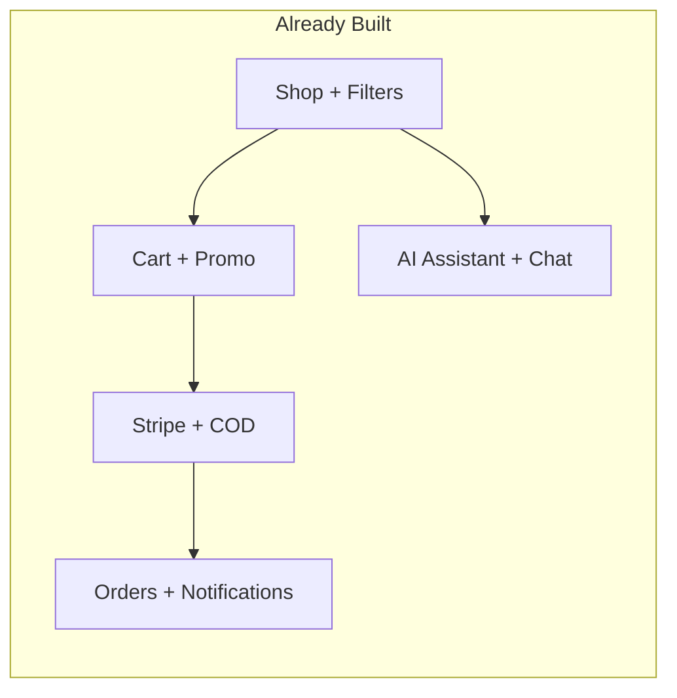
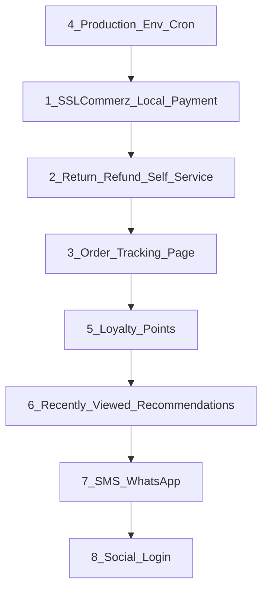

# ই-কমার্স ফিচার সাজেশন ও রোডম্যাপ

## বর্তমানে যা আছে (সংক্ষেপে)

আপনার প্রজেক্ট সাধারণ Payload টেমপ্লেটের চেয়ে অনেক এগিয়ে। ইতিমধ্যে আছে:

- **কোর কমার্স:** ক্যাটালগ, ভ্যারিয়েন্ট, কার্ট, গেস্ট চেকআউট, অর্ডার, Stripe + COD
- **বাংলাদেশ লোকালাইজেশন:** BDT, জেলা-ভিত্তিক ঠিকানা, Dhaka/বাইরে শিপিং জোন, Steadfast/Pathao/RedX ট্র্যাকিং
- **গ্রোথ ফিচার:** প্রোমো কোড, উইশলিস্ট, ৩-প্রোডাক্ট কম্পেয়ার, মডারেটেড রিভিউ, অ্যাব্যান্ডনড কার্ট ইমেইল
- **অ্যাডভান্সড:** AI শপিং অ্যাসিস্ট্যান্ট, সেমান্টিক সার্চ, লাইভ সাপোর্ট চ্যাট, নোটিফিকেশন/পুশ, সেলস ড্যাশবোর্ড, Google Merchant feed, geo SEO

নিচের সাজেশনগুলো **গ্যাপ ফিল** এবং **বিজনেস ইমপ্যাক্ট** অনুযায়ী সাজানো।

---

## Tier 1 — সবচেয়ে বেশি ইমপ্যাক্ট (প্রথমে করুন)

### 1. বাংলাদেশি পেমেন্ট গেটওয়ে (bKash / Nagad / SSLCommerz)

**কেন:** বাংলাদেশে অনলাইন শপে COD ছাড়াও মোবাইল ওয়ালেট ও গেটওয়ে সবচেয়ে বেশি ব্যবহৃত। Stripe আছে কিন্তু লোকাল পেমেন্ট নেই।

**কী করবেন:**
- [src/plugins/cashOnDeliveryAdapter.ts](src/plugins/cashOnDeliveryAdapter.ts) প্যাটার্ন অনুসরণ করে নতুন adapter (যেমন `sslCommerzAdapter` বা `bkashAdapter`)
- [src/plugins/index.ts](src/plugins/index.ts)-এ checkout payment methods এক্সটেন্ড
- [src/components/checkout/CheckoutPage.tsx](src/components/checkout/CheckoutPage.tsx)-এ পেমেন্ট মেথড UI

**প্রাথমিক সুপারিশ:** SSLCommerz (এক গেটওয়েতে bKash, Nagad, কার্ড) — একবারে অনেক মেথড কভার হয়।

---

### 2. কাস্টমার রিটার্ন / রিফান্ড / ক্যানসেল সেলফ-সার্ভিস

**কেন:** অর্ডার স্ট্যাটাসে `refunded`/`cancelled` admin-সাইডে আছে ([src/plugins/index.ts](src/plugins/index.ts)) কিন্তু কাস্টমার নিজে রিটার্ন রিকোয়েস্ট করতে পারে না — সাপোর্ট চ্যাটের লোড বাড়ে।

**কী করবেন:**
- নতুন `ReturnRequests` collection (order, items, reason, photos, status)
- [src/app/(app)/(account)/orders/[id]/page.tsx](src/app/(app)/(account)/orders/[id]/page.tsx)-এ "Return / Cancel" বাটন
- Admin-এ approve/reject workflow + existing order status timeline-এর সাথে sync
- নোটিফিকেশন হুক ([src/collections/UserNotifications/](src/collections/UserNotifications/)) দিয়ে স্ট্যাটাস আপডেট

---

### 3. অর্ডার ট্র্যাকিং পেজ (পাবলিক, গেস্ট-ফ্রেন্ডলি)

**কেন:** `find-order` ও `accessToken` আছে, কিন্তু ডেডিকেটেড **লাইভ ট্র্যাকিং UI** (carrier status, ETA, map/link) কনভার্শন ও সাপোর্ট কল কমায়।

**কী করবেন:**
- `/track-order` বা `/orders/[id]/track` — Steadfast/Pathao/RedX API বা manual tracking link
- SMS/WhatsApp শেয়ার লিংক (অর্ডার কনফার্মেশন ইমেইলে)
- Existing [src/collections/Orders/notifyOrderShipped.ts](src/collections/Orders/notifyOrderShipped.ts) এক্সটেন্ড

---

### 4. প্রোডাকশন env ও ক্রন জব সেটআপ চেকলিস্ট

**কেন:** অনেক ফিচার `.env`-এর উপর নির্ভরশীল — Stripe, AI (`DEEPSEEK_API_KEY`), VAPID push, GA4/Meta, SMTP, `CRON_SECRET`। BETA স্ট্যাটাসে ([README.md](README.md)) এগুলো না থাকলে ফিচার "নেই" মনে হবে।

**কী করবেন (ফিচার নয়, কিন্তু জরুরি):**
- Admin health/status page: কোন সার্ভিস configured / missing
- Abandoned cart cron: [src/app/(app)/api/cron/abandoned-carts/route.ts](src/app/(app)/api/cron/abandoned-carts/route.ts)
- Notification broadcast cron: [src/app/(app)/api/cron/notifications/route.ts](src/app/(app)/api/cron/notifications/route.ts)

---

## Tier 2 — কনভার্শন ও রিটেনশন

### 5. লয়ালটি / রিওয়ার্ড পয়েন্ট

**কেন:** Wishlist, promo, notifications আছে — কিন্তু **রিপিট পারচেজ** উৎসাহের জন্য পয়েন্ট সিস্টেম নেই।

**কী করবেন:**
- `LoyaltyTransactions` collection (earn on order, redeem at checkout)
- Checkout-এ "Use points" — existing promo engine ([src/collections/PromoCodes/](src/collections/PromoCodes/))-এর পাশাপাশি
- Account dashboard-এ balance + history

---

### 6. রিসেন্টলি ভিউড ও পার্সোনালাইজড রেকমেন্ডেশন

**কেন:** AI assistant ও semantic search আছে — কিন্তু **"আপনি যা দেখেছেন"** ও **"আপনার জন্য"** সেকশন কনভার্শন বাড়ায়।

**কী করবেন:**
- Client-side `recentlyViewed` (localStorage) + logged-in user-এর জন্য DB sync
- Shop/PDP-তে carousel block — existing [src/blocks/TopSellingProducts/](src/blocks/) প্যাটার্ন
- Optional: embedding-based "similar products" ([src/lib/ai/semanticSearch.ts](src/lib/ai/semanticSearch.ts)) reuse

---

### 7. সোশ্যাল লগইন (Google / Facebook)

**কেন:** [src/collections/Users/index.ts](src/collections/Users/index.ts)-এ email/password আছে — সাইনআপ ফ্রিকশন কমাতে OAuth দরকার।

**কী করবেন:**
- NextAuth বা Payload OAuth plugin
- Checkout-এ "Continue with Google" — গেস্ট চেকআউট ফ্লো ([README.md](README.md) guest checkout) এর সাথে merge

---

### 8. SMS / WhatsApp অর্ডার নোটিফিকেশন

**কেন:** ইমেইল (Nodemailer) আছে — বাংলাদেশে SMS/WhatsApp ওপেন রেট বেশি।

**কী করবেন:**
- Order placed, shipped, delivered events-এ Twilio / local SMS gateway / WhatsApp Business API
- [src/collections/Orders/sendOrderConfirmationEmail.ts](src/collections/Orders/sendOrderConfirmationEmail.ts) প্যাটার্নে parallel channel

---

### 9. প্রোডাক্ট Q&A (রিভিউর পাশাপাশি)

**কেন:** [ProductReviews](src/collections/ProductReviews/index.ts) আছে — কিন্তু pre-purchase প্রশ্ন ("এটা XL সাইজে আছে?") আলাদা ফ্লো।

**কী করবেন:**
- `ProductQuestions` collection + PDP সেকশন
- Staff/admin উত্তর → SEO-friendly (geo content প্যাটার্ন: [src/lib/seo/geoContent/](src/lib/seo/geoContent/))

---

## Tier 3 — অপারেশন ও স্কেল

### 10. ইনভেন্টরি অ্যালার্ট ও লো-স্টক ড্যাশবোর্ড

**কেন:** Inventory decrement on order আছে ([src/collections/Orders/decrementInventoryOnOrderCreate.ts](src/collections/Orders/decrementInventoryOnOrderCreate.ts)) — কিন্তু **রিঅর্ডার threshold** admin alert নেই।

**কী করবেন:**
- Variant-এ `reorderLevel` field
- Sales dashboard ([src/components/admin/SalesDashboard/](src/components/admin/SalesDashboard/))-এ low-stock widget
- Staff notification broadcast integration

---

### 11. বাল্ক অর্ডার / B2B কোটেশন

**কেন:** Shipment profiles ও zone pricing আছে — wholesale/B2B এক্সটেনশন সহজ।

**কী করবেন:**
- "Request quote" form on PDP (form builder already: [src/blocks/Form/](src/blocks/Form/))
- Staff inbox বা sales dashboard-এ quote pipeline

---

### 12. মাল্টি-ওয়্যারহাউস / স্টক লোকেশন (যদি দরকার হয়)

**কেন:** Single inventory per variant — ঢাকা vs চট্টগ্রাম স্টক আলাদা করতে চাইলে প্রয়োজন।

**কী করবেন:**
- `StockLocations` + variant inventory per location
- Checkout shipping quote ([src/lib/shipping/cartShipmentQuote.ts](src/lib/shipping/cartShipmentQuote.ts)) location-aware

---

### 13. অ্যাডভান্সড অ্যানালিটিক্স ড্যাশবোর্ড

**কেন:** Sales dashboard + GA4/Meta আছে — কিন্তু **funnel** (view → cart → checkout → purchase) ও **cohort** এক জায়গায় নেই।

**কী করবেন:**
- Server-side event log (product view, add to cart)
- Dashboard: conversion rate, AOV, top abandoned products
- Existing [src/app/(app)/api/analytics/purchase/route.ts](src/app/(app)/api/analytics/purchase/route.ts) extend

---

## Tier 4 — পলিশ ও ডিফারেনশিয়েশন

| ফিচার | মূল্য | নোট |
|--------|--------|------|
| **Gift cards** | উপহার সিজনে সেলস | Promo engine reuse possible |
| **Bundle / combo offers** | AOV বাড়ায় | Cart hooks already robust |
| **Flash sale countdown** | Urgency | [CountdownPromo block](src/blocks/) আছে — PDP/cart tie-in |
| **Referral program** | অর্গানিক গ্রোথ | Unique referral code per user |
| **Multi-language (BN/EN)** | লোকাল UX | Payload i18n + next-intl |
| **PWA / offline cart** | মোবাইল UX | Web push already ([PushSubscriptions](src/collections/PushSubscriptions/index.ts)) |
| **AR / size guide** | ফ্যাশন/ফার্নিচার | Media + variant metadata |
| **Subscription / repeat order** | consumables | নতুন collection + cron |

---

## প্রস্তাবিত ইমপ্লিমেন্টেশন ক্রম

**ফেজ ১ (৪–৬ সপ্তাহ):** Tier 1 — লোকাল পেমেন্ট, রিটার্ন ফ্লো, ট্র্যাকিং, প্রোডাকশন সেটআপ  
**ফেজ ২ (৪–৬ সপ্তাহ):** Tier 2 — লয়ালটি, রেকমেন্ডেশন, SMS, Q&A  
**ফেজ ৩ (অন ডিমান্ড):** Tier 3–4 — B2B, অ্যাডভান্সড অ্যানালিটিক্স, gift cards

---

## যা ইতিমধ্যে শক্তিশালী — নতুন করে বানানোর দরকার নেই

এইগুলোতে বড় ইনভেস্টমেন্টের বদলে **পলিশ ও মনিটর** করুন:

- AI assistant + semantic search — prompt/embedding quality টিউন
- Live support chat — SLA metrics, canned replies
- Product alerts (back-in-stock) — [ProductAlerts](src/collections/ProductAlerts/index.ts)
- Compare + wishlist — UX polish
- Google Merchant feed — inventory sync verify
- Staff RBAC — audit log যোগ করা যেতে পারে

---

## সারাংশ

আপনার প্রজেক্টে **কোর ই-কমার্স + বাংলাদেশ-স্পেসিফিক + AI/চ্যাট** ইতিমধ্যে শক্তিশালী। পরবর্তী সবচেয়ে মূল্যবান যোগ হবে:

1. **লোকাল পেমেন্ট** (bKash/Nagad/SSLCommerz)
2. **কাস্টমার সেলফ-সার্ভিস রিটার্ন/রিফান্ড**
3. **পাবলিক অর্ডার ট্র্যাকিং**
4. **লয়ালটি + পার্সোনালাইজড রেকমেন্ডেশন**
5. **SMS/WhatsApp নোটিফিকেশন**

এগুলো আপনার existing infrastructure ([checkout adapters](src/plugins/), [notifications](src/collections/UserNotifications/), [orders](src/plugins/index.ts), [chat](src/components/chat/))-এর উপর natural extension — বড় refactor ছাড়াই incremental ভাবে যোগ করা সম্ভব।
