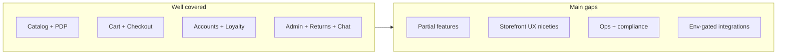

# Ecommerce Feature Gap Analysis

**Scope:** What is missing or incomplete in [my-project](/Users/bddacmac168/Desktop/personal/my-project), excluding **payment processing** and **order tracking** (fulfillment status, carrier tracking, guest find-order, shipped notifications are treated as in-scope and not listed as gaps).

**Baseline:** This is a feature-rich Bangladesh-focused store (BDT, district shipping). Core flows—catalog, cart, checkout, accounts, wishlists, reviews, search/filters, inventory, promos, loyalty, returns, chat, admin RBAC, SEO, analytics—are implemented with strong test coverage under [`tests/int/`](/Users/bddacmac168/Desktop/personal/my-project/tests/int/).

---

## 1. Partial implementations (backend exists, UX or automation incomplete)

These are the highest-impact gaps because code or data models already exist.

| Gap | Current state | Evidence |
|-----|---------------|----------|
| **Repeat-order subscriptions** | Collection + API + account list; cron sends email/push reminders only | Admin copy says “can place orders” but [`api/cron/subscriptions/route.ts`](/Users/bddacmac168/Desktop/personal/my-project/src/app/(app)/api/cron/subscriptions/route.ts) only notifies; no auto-order. Account UI says “Subscribe from a product page” but **no PDP subscribe UI** exists ([`SubscriptionsPanel.tsx`](/Users/bddacmac168/Desktop/personal/my-project/src/components/account/SubscriptionsPanel.tsx) vs no matches under `components/product/`). |
| **Gift cards — purchase flow** | Redemption at checkout works; cards are admin-issued | [`GiftCards`](/Users/bddacmac168/Desktop/personal/my-project/src/collections/GiftCards/index.ts) + checkout redemption; no storefront route to **buy** a gift card. |
| **Carrier shipping APIs** | Manual fulfillment fields only | Steadfast/Pathao/RedX are enum labels in order fulfillment ([`plugins/index.ts`](/Users/bddacmac168/Desktop/personal/my-project/src/plugins/index.ts)); no API booking or label generation. |
| **Native mobile push** | Web push (VAPID) works | [`api/push/subscribe/route.ts`](/Users/bddacmac168/Desktop/personal/my-project/src/app/(app)/api/push/subscribe/route.ts) stores placeholder FCM tokens until wired. |
| **Compare list persistence** | Works in-session | [`providers/Compare/index.tsx`](/Users/bddacmac168/Desktop/personal/my-project/src/providers/Compare/index.tsx) uses localStorage only—no account sync (unlike wishlist). |
| **Guest wishlist merge** | By design, local until login | Data lost if localStorage cleared before auth ([`providers/Wishlist`](/Users/bddacmac168/Desktop/personal/my-project/src/providers/Wishlist/index.tsx)). |
| **Order-update notification pref** | UI placeholder | [`NotificationPreferencesForm.tsx`](/Users/bddacmac168/Desktop/personal/my-project/src/components/notifications/NotificationPreferencesForm.tsx): “Reserved for future order-status messages.” |
| **SEO / GEO content** | Fields + generators exist | Editorial gap: ~60% content readiness per [`docs/seo-aiso-readiness.md`](/Users/bddacmac168/Desktop/personal/my-project/docs/seo-aiso-readiness.md). |
| **AI features** | Full code paths | Disabled without `DEEPSEEK_API_KEY` or `OPENROUTER_API_KEY` ([`lib/ai/config.ts`](/Users/bddacmac168/Desktop/personal/my-project/src/lib/ai/config.ts)). |
| **Email-dependent flows** | Nodemailer when configured | Abandoned cart, password reset, order emails need `SMTP_HOST` ([`payload.config.ts`](/Users/bddacmac168/Desktop/personal/my-project/src/payload.config.ts)). |
| **Klaviyo ESP sync** | Form submissions only | [`lib/marketing/afterFormSubmissionEsp.ts`](/Users/bddacmac168/Desktop/personal/my-project/src/lib/marketing/afterFormSubmissionEsp.ts)—no full customer/order lifecycle sync. |

---

## 2. Storefront UX and conversion gaps

Common ecommerce patterns not present (or only partially covered by adjacent features).

| Gap | Notes |
|-----|-------|
| **Buy again / reorder** | No reorder action on order history ([`components/orders/`](/Users/bddacmac168/Desktop/personal/my-project/src/components/orders/) has no reorder flow). |
| **Cart “save for later”** | Wishlist button label says “Save for later” but there is no move-item-from-cart-to-saved-list flow in [`components/Cart/`](/Users/bddacmac168/Desktop/personal/my-project/src/components/Cart/). |
| **Quick view on shop grid** | No product quick-view modal; PDP navigation only. |
| **Variant facet filters** | Shop filters cover category, subcategory, brand, badge, price, in-stock ([`shopFilterFacets.ts`](/Users/bddacmac168/Desktop/personal/my-project/src/lib/search/shopFilterFacets.ts))—no size/color/attribute filters. |
| **Delivery date / time slot picker** | District + shipment-type quotes only ([`CheckoutShipping.tsx`](/Users/bddacmac168/Desktop/personal/my-project/src/components/checkout/CheckoutShipping.tsx)); no customer-chosen delivery window. |
| **Checkout gift message / order notes** | No customer-facing special instructions field at checkout (grep found no `order note` / `gift message` fields). |
| **Estimated delivery on PDP** | Shipping cost/ETA only surfaced at checkout, not on product page. |
| **Review photos / helpful votes** | Reviews are text + stars only ([`ProductReviews/index.ts`](/Users/bddacmac168/Desktop/personal/my-project/src/collections/ProductReviews/index.ts)); no photo uploads or “was this helpful?” |
| **Review filtering on PDP** | Summary stats exist; no star-rating filter UI on review list. |
| **Social proof widgets** | No “recently purchased” or live-activity popups (analytics beacons exist, not surfaced as UI). |
| **Pre-order / backorder** | No allow-backorder or pre-order SKU mode; inventory is hard-checked at cart/order. |
| **Per-SKU purchase limits** | Inventory caps quantity; no max-per-customer or min-qty rules beyond promo `minOrderSubtotal`. |
| **Product personalization** | No engraving, monogram, or customization options. |
| **Gift wrap / gift registry** | Not implemented. |

---

## 3. Catalog, pricing, and B2B gaps

| Gap | Notes |
|-----|-------|
| **Multi-currency / multi-language** | BDT only ([`lib/ecommerceCurrency.ts`](/Users/bddacmac168/Desktop/personal/my-project/src/lib/ecommerceCurrency.ts)); no i18n layer. |
| **Sales tax / VAT** | No tax engine; prices appear tax-inclusive as entered. |
| **Customer groups / tier pricing** | No wholesale price lists or role-based catalog pricing; B2B is limited to **quote requests** ([`QuoteRequests`](/Users/bddacmac168/Desktop/personal/my-project/src/collections/QuoteRequests/index.ts)). |
| **Affiliate / influencer program** | Referral codes exist for customers; no commission tracking or affiliate dashboard. |
| **Digital / downloadable products** | Physical SKU model only. |
| **Weight-based shipping** | Shipment profiles use district + qty rules ([`Shipment/index.ts`](/Users/bddacmac168/Desktop/personal/my-project/src/collections/Shipment/index.ts)); no package weight/dimensions. |
| **Store pickup / store locator** | “Pickup point” is a **delivery type** in shipment pricing, not a physical store locator or BOPIS flow. |
| **Scheduled product publish** | Draft/publish exists; no `publishAt` scheduling. |
| **Bulk product import/export** | No CSV/PIM import pipeline in admin. |

---

## 4. Operations, compliance, and trust gaps

| Gap | Notes |
|-----|-------|
| **Stock reservation during checkout** | Inventory decremented on order create; no hold/reservation while customer completes checkout (race risk at scale). |
| **Return shipping labels** | Return workflow + photo upload exists; customers cannot print prepaid return labels. |
| **Store credit / wallet** | Loyalty points + gift cards cover some cases; no general refundable store-credit balance. |
| **Tax invoice / PDF receipt** | Print-friendly order receipt exists ([`orders/[id]/page.tsx`](/Users/bddacmac168/Desktop/personal/my-project/src/app/(app)/(account)/orders/[id]/page.tsx)); no formal tax invoice PDF generation. |
| **Admin audit log** | No activity/audit trail for staff actions. |
| **GDPR / privacy self-service** | No cookie consent banner, account deletion, or data-export flow. |
| **Bot protection** | No CAPTCHA/Turnstile on auth, checkout, or forms. |
| **2FA / phone OTP login** | Email/password + Google/Facebook OAuth only ([`SocialLoginButtons.tsx`](/Users/bddacmac168/Desktop/personal/my-project/src/components/auth/SocialLoginButtons.tsx)). |
| **WMS / pick-pack** | Multi-location inventory + low-stock alerts exist; no pick lists, barcode scan, or pack-station workflow. |
| **ERP / accounting export** | Sales dashboard only; no QuickBooks/Xero sync. |

---

## 5. What is already strong (for context)

Do **not** treat these as gaps—they are implemented:

- Product catalog (variants, bundles, flash sales, AR, size guide, specs)
- Cart (guest merge, promo/loyalty/gift-card hooks, abandoned-cart cron)
- Checkout (guest, district addresses, multi-shipment split, shipping quote)
- Accounts (addresses, OAuth, referral, loyalty, subscriptions list)
- Wishlist, compare (local), recently viewed (local + server when logged in)
- Reviews + Q&A with moderation and verified purchase
- Hybrid + AI search, shop filters, infinite scroll
- Multi-location inventory, low-stock staff alerts
- Promos, gift card **redemption**, loyalty earn/redeem
- Returns/cancellations with refund calculation
- Live chat + AI assistant + staff inbox
- Notifications (push, SMS, WhatsApp, price/stock alerts, broadcasts)
- Admin sales dashboard, fraud scoring, staff RBAC
- SEO (sitemap, IndexNow, JSON-LD, Merchant feed, llms.txt)
- GA4, Meta Pixel/CAPI, PWA, social share row

---

## 6. Suggested priority if you want to close gaps

**High (conversion + promised UX):**
1. PDP subscription subscribe UI + clarify reminder-only vs auto-order behavior
2. Buy again from order history
3. Gift card purchase storefront
4. Checkout order notes / gift message
5. Variant attribute filters (size/color) if catalog uses many variants

**Medium (ops + trust):**
6. Carrier API integration (if manual entry is a bottleneck)
7. Stock reservation or optimistic locking at checkout
8. Review photos + helpful votes
9. Delivery ETA on PDP
10. Populate SEO/GEO CMS tabs (editorial, not code)

**Lower (scale / market expansion):**
11. Multi-language / multi-currency
12. Tax engine
13. Customer-group pricing
14. GDPR cookie consent + data export
15. Bulk product import, WMS, ERP integrations

---

## Summary

This app is **not missing core ecommerce**—it exceeds typical MVP scope. The meaningful gaps fall into four buckets:

1. **Half-built features** — subscriptions, gift-card purchase, native push, compare sync
2. **Conversion UX** — reorder, cart save-for-later, quick view, variant filters, checkout notes
3. **Market/compliance** — single locale/currency, no tax engine, no GDPR tooling
4. **Env/editor dependencies** — AI, SMTP, Klaviyo, GEO content population

No implementation is proposed here; this is an audit only. Say which bucket you want to tackle first if you want a follow-up implementation plan.
