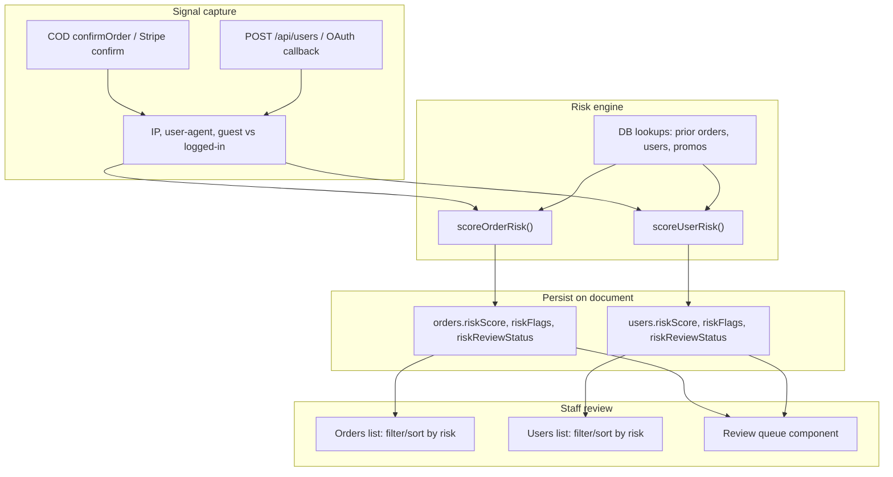
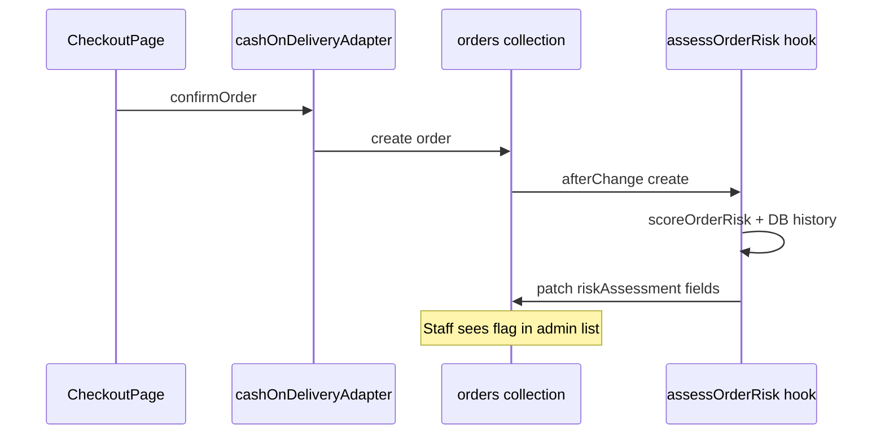

# Fake Order & Registration Detection Plan

## Current state

Your storefront has **strong checkout integrity** (cart secrets, inventory checks, duplicate-checkout prevention, transaction authorization in [`src/plugins/cashOnDeliveryAdapter.ts`](src/plugins/cashOnDeliveryAdapter.ts)) but **no fraud scoring or review workflow**.

| Area | What exists | Gap |
|------|-------------|-----|
| Orders | Created only via payment adapters; COD is primary path | No velocity, address-history, or delivery-outcome signals |
| Registration | IP rate limits in [`src/middleware.ts`](src/middleware.ts) (3/hr + 5/min on `POST /api/users`) | No CAPTCHA, no email verification, in-memory limiter resets on deploy ([`SECURITY_AUDIT.md`](SECURITY_AUDIT.md)) |
| Promo abuse | [`validatePromoForCart.ts`](src/lib/promoCodes/validatePromoForCart.ts) caps redemptions | No cross-account linking (same phone/IP/referral patterns) |
| Admin | [`OrderDateRangeFilter`](src/components/admin/OrderDateRangeFilter/index.tsx) for CSV export | No “suspicious” filter or review queue |

Your existing roadmap item #19 aligns with this: **rule-based score + admin review queue** ([`.cursor/plans/ai_e-commerce_roadmap_cb89431b.plan.md`](.cursor/plans/ai_e-commerce_roadmap_cb89431b.plan.md)).

---

## Goal (your choices)

- Catch **COD no-shows**, **bot/bulk signups**, and **promo/referral abuse**
- **Flag only** — staff decides; checkout and registration always proceed

---

## Architecture



---

## Detection signals

### Fake / risky orders

Use normalized phone via existing helpers in [`contactToLoginEmail.ts`](src/utilities/contactToLoginEmail.ts) and order fields already on the schema (`customerPhone`, `customerEmail`, `shippingAddress`, `status`, `paymentMethod`, promo/loyalty fields).

| Signal | Weight | Query / logic |
|--------|--------|---------------|
| Guest COD checkout | +15 | `!customer && paymentMethod === 'cash-on-delivery'` |
| High COD amount (configurable threshold, e.g. > 5,000 BDT) | +20 | `amount` on order |
| Phone velocity: ≥ N orders in 24h from same normalized phone | +25 | Query `orders` by `customerPhone` / linked user phone |
| Same phone, prior cancelled/refunded orders | +30 | Count orders where `status in (cancelled, refunded)` |
| Same phone, zero delivered/completed orders but ≥2 processing orders | +20 | Delivery history from `status` + `statusTimeline` |
| Duplicate address cluster: same `fullAddress` + `district` used by ≥3 distinct phones in 7 days | +25 | Aggregate on shipping address |
| Promo on first order from guest | +15 | `appliedPromoCode` + no prior orders for phone |
| Loyalty/gift card on brand-new account (< 24h old) | +15 | User `createdAt` + redemption fields |
| Referral reward path: user has `referredBy` and order within 1h of signup | +20 | Join user + order timestamps |
| Weak address: `fullAddress` very short or matches blocklist (`test`, `asdf`, digits-only) | +10 | Regex/heuristic |
| Same IP as other high-risk orders in 24h | +15 | Requires capturing IP at checkout (see below) |

**Score bands (suggested):**
- 0–24: `low` (no flag)
- 25–49: `medium` (optional badge)
- 50+: `high` → appears in review queue

### Fake / risky registrations

| Signal | Weight | Query / logic |
|--------|--------|---------------|
| Registration burst: ≥3 users from same IP in 1h | +30 | Requires IP capture on create |
| Disposable email domain | +25 | Blocklist (`mailinator.com`, etc.) when real email provided |
| Suspicious name (random chars, `test`, `user123`) | +10 | Regex |
| Phone already tied to another account (normalized collision) | +40 | Query users by normalized phone variants from `resolveLoginEmails` |
| Referral code used + account created within seconds of referrer’s other referrals | +20 | Query `referredBy` siblings by time |
| OAuth account with no phone and immediate high-value cart activity | +15 | Post-hoc link via orders after signup |
| Synthetic-only email (`phone.*@example.com`) with no real email | +5 | Low weight — normal for your BD phone-first flow |

---

## Implementation phases

### Phase 1 — Schema & metadata capture

Add a shared **`riskAssessment`** group to both collections:

```ts
// Conceptual shape (orders + users)
{
  riskScore: number          // 0–100, computed
  riskLevel: 'low' | 'medium' | 'high'
  riskFlags: { flag: string; weight: number; detail?: string }[]
  riskReviewStatus: 'pending' | 'cleared' | 'confirmed_fraud'  // staff-set
  riskReviewedAt?: date
  riskReviewedBy?: relationship → users
  riskCapturedIp?: string    // from x-forwarded-for / x-real-ip
  riskCapturedUserAgent?: string
}
```

**Files:**
- [`src/plugins/index.ts`](src/plugins/index.ts) — add fields to `ordersCollectionOverride`; extend `defaultColumns` with `riskLevel`, `riskReviewStatus`
- [`src/collections/Users/index.ts`](src/collections/Users/index.ts) — same fields; add `defaultColumns`
- New migration under `src/migrations/`
- Regenerate types (`payload-types.ts`)

**IP / user-agent capture:** small helper `src/lib/risk/captureRequestContext.ts` reading `req.headers` (same pattern as [`middleware.ts`](src/middleware.ts) `clientIp`). Call from:
- Order: `afterChange` hook on create (needs full order doc + async DB lookups)
- User: `afterChange` on create in [`Users/index.ts`](src/collections/Users/index.ts)

Using `afterChange` avoids blocking the transaction and matches your flag-only requirement.

### Phase 2 — Rule-based scoring engine

New module tree:

```
src/lib/risk/
  captureRequestContext.ts
  normalizeRiskPhone.ts          // reuse contactToLoginEmail normalization
  scoreOrderRisk.ts
  scoreUserRisk.ts
  types.ts
  flagCatalog.ts                 // human labels for admin UI
```

**Order hook:** `src/collections/Orders/hooks/assessOrderRisk.ts`
- Runs on `afterChange` when `operation === 'create'`
- Calls `scoreOrderRisk({ payload, order, req })`
- Updates same document with `overrideAccess: true` (guard with `req.context.riskAssessed` to prevent loops)

**User hook:** `src/collections/Users/hooks/assessUserRisk.ts`
- Same pattern on user create

**COD integration point:** optionally pass checkout IP into transaction/order metadata from [`cashOnDeliveryAdapter.ts`](src/plugins/cashOnDeliveryAdapter.ts) `confirmOrder` if `req` is available there — improves accuracy vs. post-create-only capture.

### Phase 3 — Admin review queue (flag-only UX)

1. **List filters** — Payload `admin` list filter presets:
   - Orders: `riskLevel equals high`, `riskReviewStatus equals pending`
   - Users: same

2. **Review queue component** — `src/components/admin/RiskReviewQueue/index.tsx`
   - Register in `beforeListTable` alongside existing [`OrderDateRangeFilter`](src/components/admin/OrderDateRangeFilter/index.tsx)
   - Tabbed: “High-risk orders (pending)” / “High-risk users (pending)”
   - Row actions: Open document, mark **Cleared** or **Confirmed fraud** (PATCH via Payload REST)

3. **Edit view badge** — `beforeDocumentControls` component showing score breakdown from `riskFlags` array (why this was flagged)

4. **Staff workflow doc** (inline admin description field):
   - Cleared → ship/process normally
   - Confirmed fraud → manual cancel + optional phone blocklist entry (future)

### Phase 4 — Retrospective identification (existing data)

One-off script or Payload task: `src/scripts/backfillRiskScores.ts`
- Paginate all orders/users created in last N days
- Run same `scoreOrderRisk` / `scoreUserRisk` without request context (IP/UA null; history signals still work)
- Staff can run from admin Jobs queue if you prefer ([Payload jobs pattern in skill docs](.agents/skills/payload/reference/ADVANCED.md))

**Immediate manual queries** (before code ships) staff can run in admin or DB:
- Orders: same `customerPhone`, count > 2, status = `processing`, created in last 7 days
- Users: multiple accounts with emails matching `phone.%@example.com` sharing overlapping digit suffixes
- Referral clusters: many users with same `referredBy` within 1 hour

### Phase 5 — Hardening (optional, not required for flag-only)

Defer unless abuse volume is high:
- Redis-backed rate limits ([`SECURITY_AUDIT.md`](SECURITY_AUDIT.md) recommendation) for checkout confirm endpoints
- Turnstile/reCAPTCHA on create-account + guest checkout
- Payload email verification for password signups
- Phone OTP verification before COD confirm (strongest COD anti-fraud, but changes UX)

---

## Key integration points



Registration path: `CreateAccountForm` → `POST /api/users` → user `afterChange` → `assessUserRisk`.

---

## Testing

| Test | Location |
|------|----------|
| Phone normalization parity | Extend [`tests/int/contactToLoginEmail.int.spec.ts`](tests/int/contactToLoginEmail.int.spec.ts) |
| Scoring rules (unit) | `tests/int/scoreOrderRisk.int.spec.ts`, `scoreUserRisk.int.spec.ts` with seeded orders/users |
| Hook idempotency | Assert no infinite loop when hook updates same doc |
| Admin filter | Manual: create guest COD order with duplicate phone → appears in queue |

---

## Recommended rollout

1. Ship schema + scoring hooks with **logging only** (write scores, hide from customers)
2. Run backfill on last 30 days; tune weights with staff feedback
3. Enable admin queue UI and train staff on Cleared vs Confirmed fraud
4. Revisit weights monthly using outcomes: cancelled COD, returned shipments, promo cost

---

## Files to create / modify (summary)

| Action | Path |
|--------|------|
| Create | `src/lib/risk/*` (engine + types) |
| Create | `src/collections/Orders/hooks/assessOrderRisk.ts` |
| Create | `src/collections/Users/hooks/assessUserRisk.ts` |
| Create | `src/components/admin/RiskReviewQueue/index.tsx` |
| Create | `src/migrations/*_risk_assessment.ts` |
| Modify | [`src/plugins/index.ts`](src/plugins/index.ts) — order fields, hooks, admin columns/components |
| Modify | [`src/collections/Users/index.ts`](src/collections/Users/index.ts) — user fields, hooks, admin columns |
| Optional | [`src/plugins/cashOnDeliveryAdapter.ts`](src/plugins/cashOnDeliveryAdapter.ts) — pass IP into order metadata |
| Create | `tests/int/scoreOrderRisk.int.spec.ts`, `scoreUserRisk.int.spec.ts` |

**Estimated effort:** ~2–3 days for Phases 1–3; Phase 4 backfill ~0.5 day.
